# Credit Risk Analysis

## Overview

With statistical insight, we took on research and experimentation with various predictive supervised machine learning algorithms to analyze statistical risks involved in credit loan grants. 

Using a dataset from LendingClub, a peer-to-peer lending services company, we processed data to perform  credit card risk assessments. Credit is an inherently unbalanced classification problem. Namely because good loans tend to outnumber risky loans. 

What is the best way to prevent risky loans? How can we predict risk on unseen data, i.e., good potential in future clients? 

With a creative approach, we ran our data through different methods to train and evaluate models, investigating which of these algorithms performs best as predicting the target outcome — whether a given potential client is a low-risk or a high risk client — given **unbalanced** classes.  

## Results 

First, we loaded, inspected and cleaned the data. The first five columns of the clean Loan Stats dataset from 2019 can be seen in this screenshot:

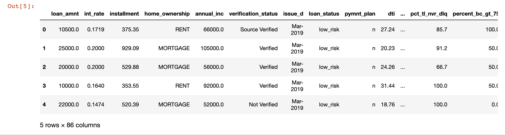

As we prepared the dataset to undergo **supervised** testing by various **machine learning** algorithms, we split the data into testing and training using **Sci-kit tools** on **Pandas** in **Jupyter Notebook**. 

We assigned the target variable for our research using the 'Loan Status' column, and assigned the 94 remainder of columns as features of our independent variable by using the *get_dummies* method to create the training variables by converting the string values into numerical ones. We also used *describe()* to obtain a statistical overview of all of our features as can be seen in the screenshot below:

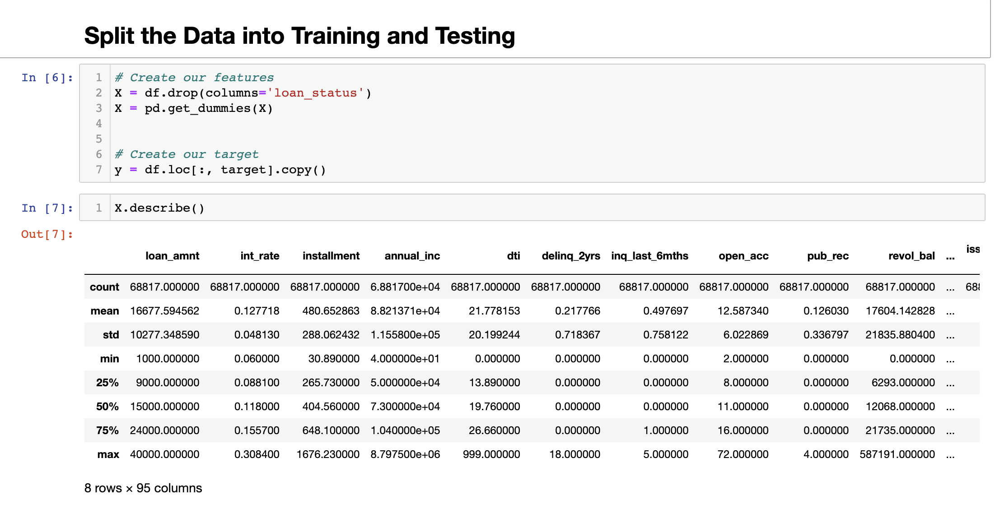

We then tested six different **machine learning models**. We used a *random state of 1* in every method uniformly to have consistent and **comparable results**. 

Below you will find, divided into categories, a brief summary and analysis of the performance of every  **machine learning model** used. We display the balanced accuracy scores, the precision and recall scores, and illustrate them with screenshots of our outputs.

## Resampling

Our first approach was to compare the performances of two oversampling algorithms, and one under-sampling algorithm. The Jupyter Notebook that contains the code for this stage of the process can be found [here](credit_risk_resampling.ipnyb).

### Oversampling

The two oversampling algorithms we used were:

- ##### Naive Random Oversampling 

  Using *Sci-kit's RandomOverSampler* we resampled the data. We then fit the model and performed a **logistic regression**. The outputs were as follows:

  - **Balanced Accuracy Score 63.59%**

    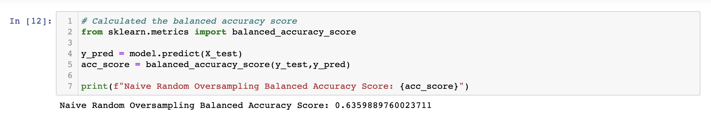

  - **Confusion Matrix**

    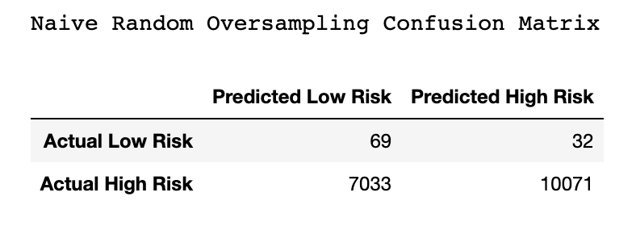

  - **Imbalanced Classification Report**

    - **Precision: 0.99**
    - **Recall: 0.59**
    - **F1: 0.71**

    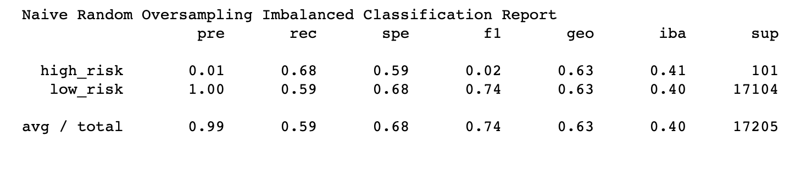

- **SMOTE** **Oversampling**

  Using *Imblearn's SMOTE over sampling* we resampled the data. We then fit the model and performed a **logistic regression**. The outputs were as follows:

  - **Balanced Accuracy Score: 66.21%**

    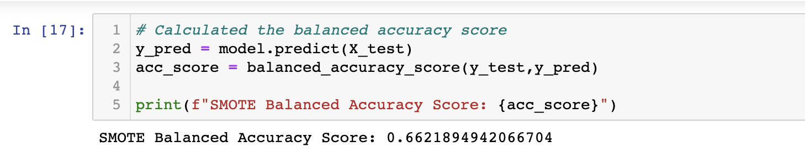

  - **Confusion Matrix**

    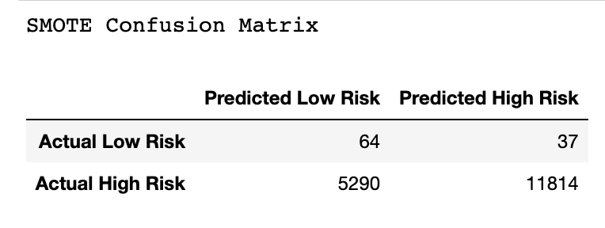

  - **Imbalanced Classification Report**

    - **Precision: 0.99**
    - **Recall: 0.69**
    - **F1: 0.81**

    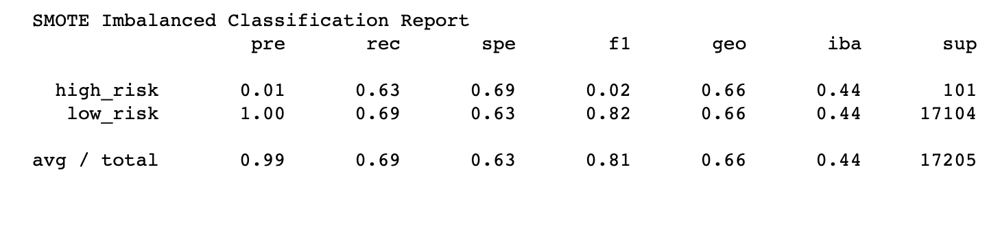

### Undersampling

The method used was:

- **Cluster Centroids Under Sampling**

  Using *Imblearn's ClusterCentroids under sampling* we resampled the data. We then fit the model and performed a **logistic regression**. The outputs were as follows:

  - **Balanced Accuracy Score 54.42%**

    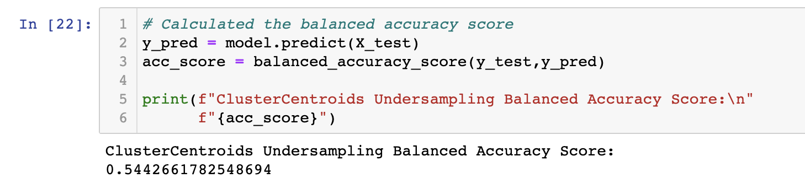

  - **Confusion Matrix**

    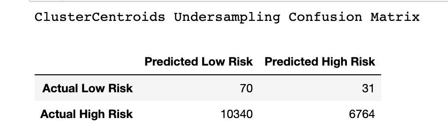

  - **Imbalanced Classification Report**

    - **Precision: 0.99**
    - **Recall: 0.40**
    - **F1: 0.56**

    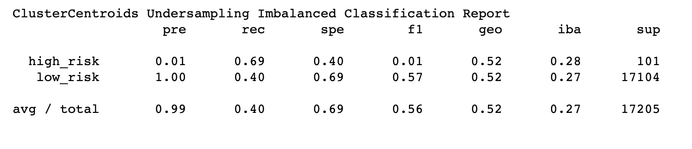

### Combination (Over and Under) Sampling

Our final resampling approach was to test a combination over- and under-sampling algorithms. We did that in the following steps:

- **SMOTEENN Combination**

  Using *Imblearn's SMOTEENN combined sampling* we resampled the data. We then fit the model and performed a **logistic regression**. The outputs were as follows:

  - **Balanced Accuracy Score 66.19%**

    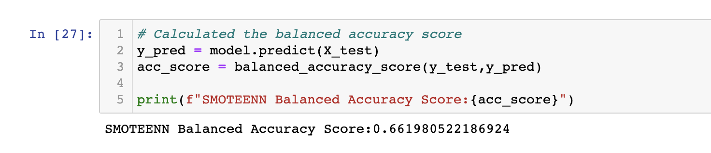

  - **Confusion Matrix**

    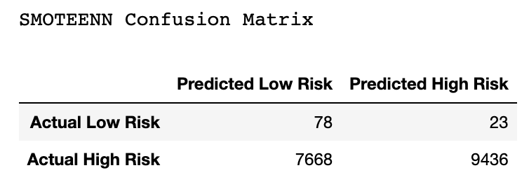

  - **Imbalanced Classification Report**

    - **Precision: 0.99**
    - **Recall: 0.55**
    - **F1: 0.71**

    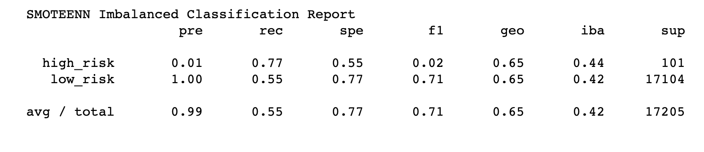

## Ensemble

Our second approach was to compare the performances of two ensemble algorithms. The Jupyter Notebook that contains the code for this stage of the process can be found [here](credit_risk_ensemble.ipnyb).

The two ensemble algorithms we used were:

- **Balanced Random Forest Classifier** 

  Using *Imblearn's BalancedRandomForestClassifier ensemble* we resampled the data. We then fit the model and performed a **classification**. The outputs were as follows:

  - **Balanced Accuracy Score 78.85%**

    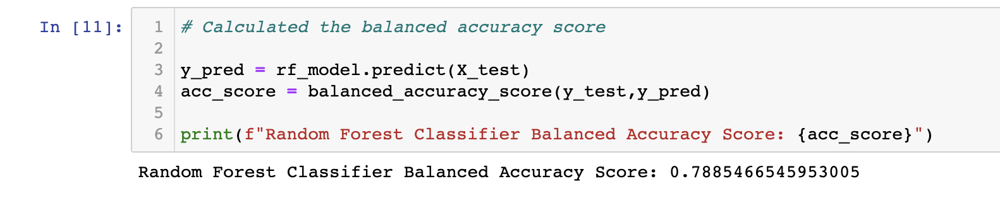

  - **Confusion Matrix**

    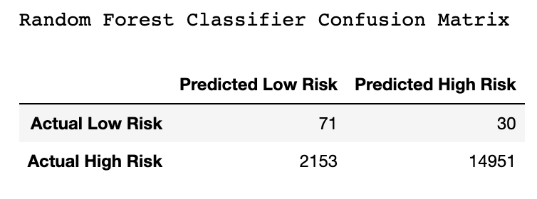

  - **Imbalanced Classification Report**

    - **Precision: 0.99**
    - **Recall: 0.87**
    - **F1: 0.93**

    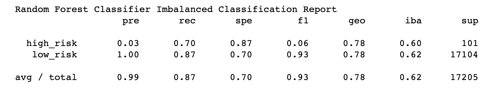

- **Easy Ensemble AdaBoost Classifier¶** 

  Using *Imblearn's EasyEnsembleClassifier* we resampled the data. We then fit the model and performed a **classification**. The outputs were as follows:

  - **Balanced Accuracy Score 78.85%**

    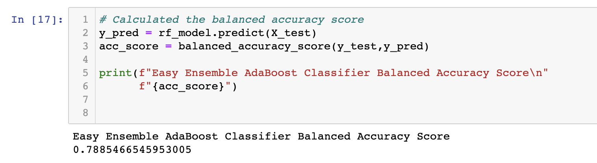

  - **Confusion Matrix**

    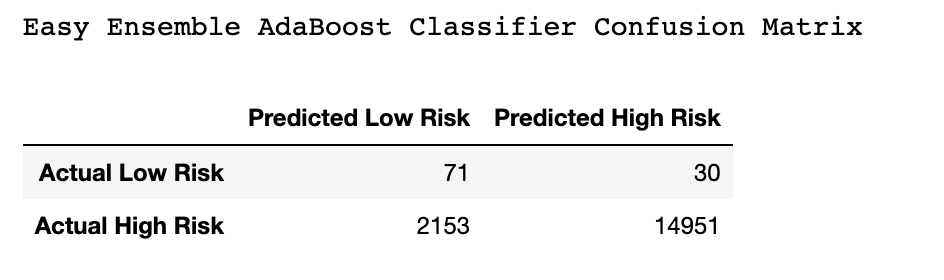

  - **Imbalanced Classification Report**

    - **Precision: 0.99**
    - **Recall: 0.87**
    - **F1: 0.93**

    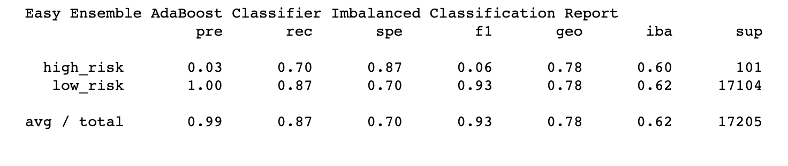

## Feature Importance

The Machine Learning algorithm that we will identify at the conclusion of our analysis as 'best performing' in the task of predicting risk for future loans and unseen data will be the tool that we recommend be utilized in the process that offers the most optimal likelihood of success to its user. 

That said, a lender will benefit from understanding how the algorithm behaves, and how each feature contributes to the predictions. This insight will inform the ongoing process of selecting new prospects and will help fine-tune the scope of data collection going forward.

We listed and sorted the 94 **features** we used to execute our analysis in descending order. 

The **DataFrame** and code used to generate it can be seen in this screenshot:

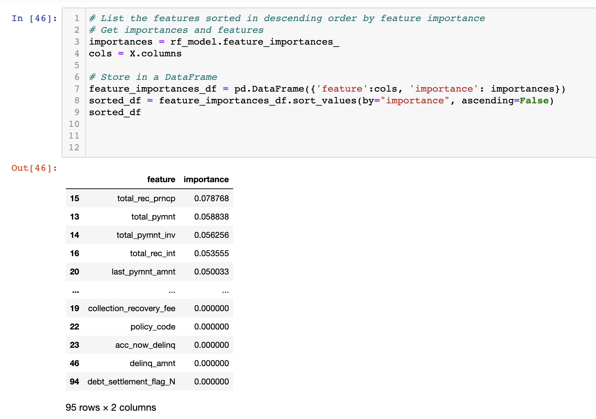

We also created a complementary bar **chart visualization** with all features appearing in descending order. This graph helps to visualize and understand the relevance of each specific feature in the context of the decision process about identifying risk in a potential loan acquirer's profile.

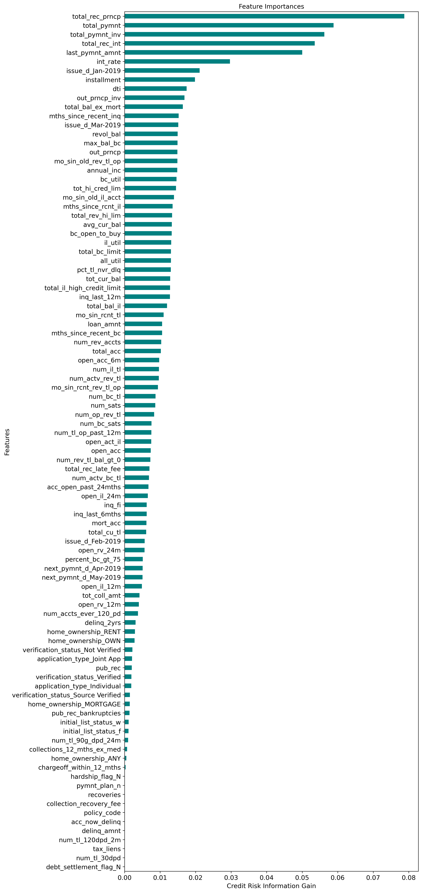

## Summary

### Supervised Machine Learning Algorithm Overall Performances

| Method                            | Balanced Accuracy(%) | Imbalanced Precision | Imbalanced Recall | Imbalanced F1 |
| --------------------------------- | -------------------- | -------------------- | ----------------- | ------------- |
| Naive Random Oversampling         | 63.59                | 0.99                 | 0.59              | 0.71          |
| SMOTE Oversampling                | 66.21                | 0.99                 | 0.69              | 0.81          |
| Cluster Centroids Undersampling   | 54.42                | 0.99                 | 0.40              | 0.56          |
| SMOTEENN Combination              | 66.19                | 0.99                 | 0.55              | 0.71          |
| Balanced Random Forest Classifier | 78.85                | 0.99                 | 0.87              | 0.93          |
| Easy Ensemble AdaBoost Classifier | 78.85                | 0.99                 | 0.87              | 0.93          |

 

### Analysis of Key Metrics

As can be seen in table above, both Ensemble algorithms performed exactly the same in this round of testing and training,  showing the same results in their accuracy and  imbalanced precision, recall and F1 scores.

As a whole, the **Ensemble** algorithms performed better than the Sampling models, as they presented higher accuracy, recall and F1 scores than the remainder of the models. 

As seen in the table above, regardless of their varying Accuracy, Recall and F1 scores, all algorithms returned 99% Precision. That's due to the high imbalance of our dataset, hence rendering the Precision metric insignificant in this particular analysis.

Both Balanced Random Forest and Easy Ensemble AdaBoost classifiers made in average 78.85% accurate predictions, in contrast with the highest performing average accuracy in the Oversampling models, which was SMOTE at 66.21%. Cluster Centroids under-sampling  markedly underperformed in terms of average accuracy, even in comparison to SMOTEENN combination, the next lowest performing –– which makes sense considering the latter utilizes a combination of Over and Under Sampling algorithm.

In terms of Recall, Balanced Random Forest and Easy Ensemble AdaBoost classifiers detected in average 87% of 'true positives' against the sum of 'true positives+false negatives'. In other words, in average 87% were correctly classified among that class. SMOTE also performed better than its counterparts in this metric, at 69%. Again with Recall we can observe the same gap we had previously seen with average accuracy of Cluster Centroids and SMOTEENN.

The F1 score, or harmonic mean between precision and recall for both Ensemble models were remarkable, at 0.93, which is very close to perfect. That said, the weighted average of F1 should generally be used to compare classifier models, and not the global accuracy. In comparison with the other models, the F1 of Balanced Random Forest and Easy Ensemble AdaBoost classifiers were significantly superior. SMOTE oversampling returned a 0.81 F1 score which is respectable and stands out amongst its resampling method counterparts.

Visualizing to evaluate information gain of each feature in the context of the target, the reduction in entropy from the transformation of a dataset was calculated. The higher the value, the more the data was transformed by a given feature. Looking at our feature importance in descending order helped evaluate the dataset as a whole, and how it affected the algorithms. Going forward, this can help with feature selection, and enhance the performance in metrics of future machine learning rounds of testing and training.

As far as recommendations, I would recommend going in the direction of using one or both of the Ensemble models as they were best performers amongst all models tested. More algorithms that deal with subsets of datasets can be used to adapt the behavior of these models and make them best suited for class imbalance. Pondering how to continue to improve the predictive power of supervised machine learning models in imbalanced classification problems is a captivating ongoing prospect that can shed light into much of the complexity embedded in machine learning algorithms.
